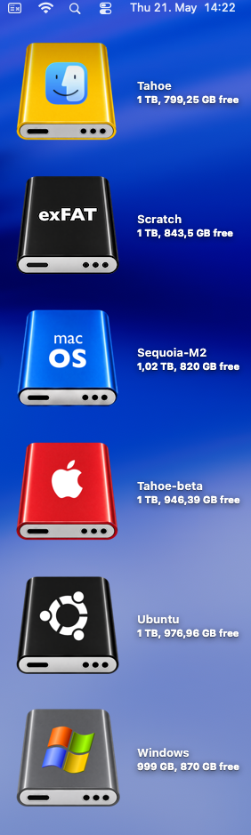
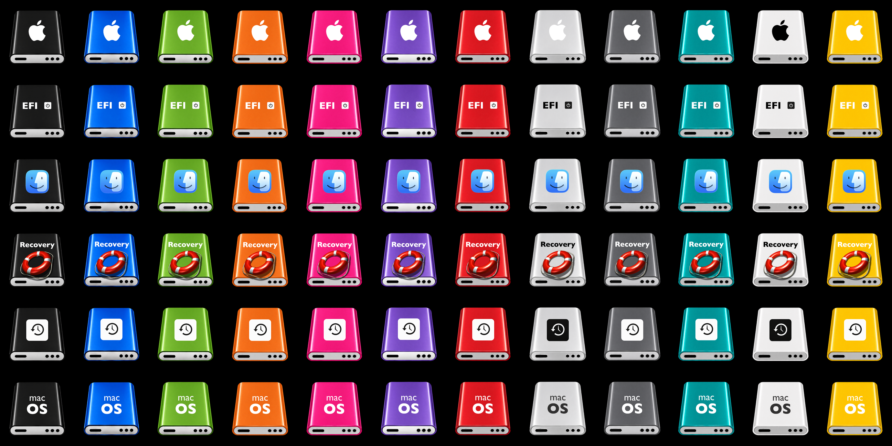
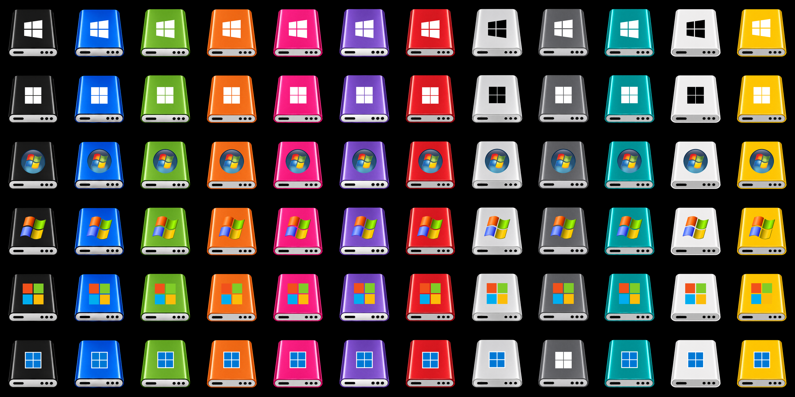
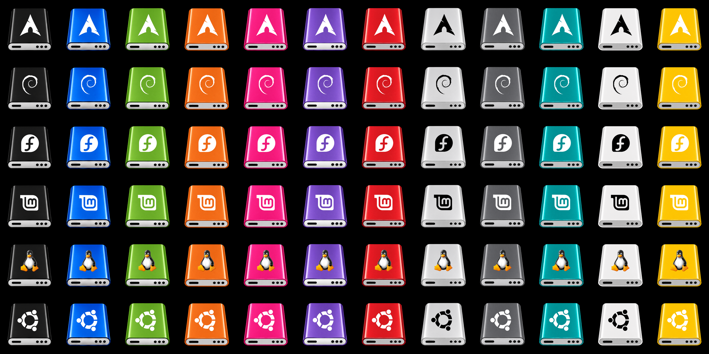
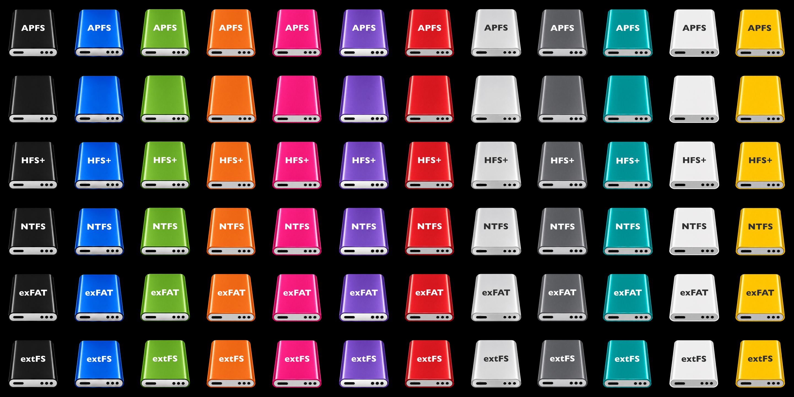
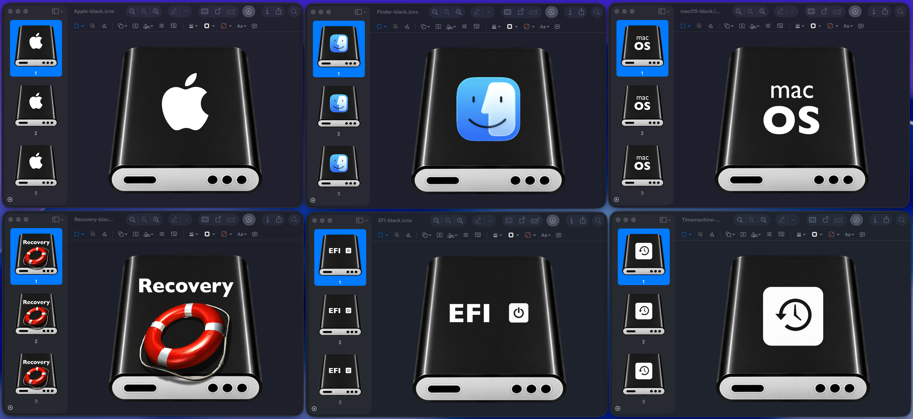
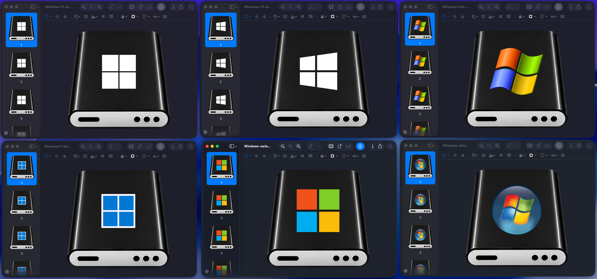
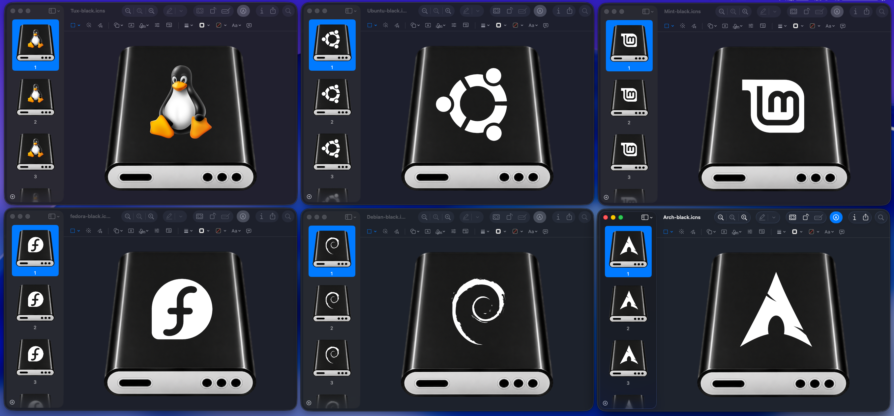
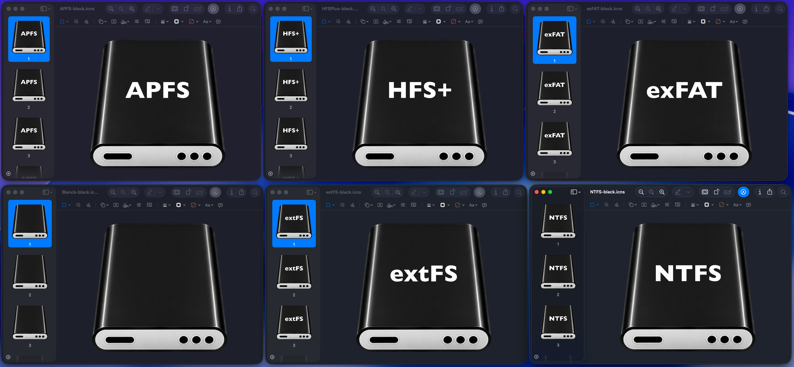

# Tahoe Drive Icons Pack

High-quality modular macOS Tahoe drive icons for macOS systems featuring:

- macOS disk drive environments
- Windows disk drive environments
- Linux disk drive environments
- EFI and Recovery environments
- multiple disk format environments

Designed for Hackintosh and macOS enthusiasts.

---

# Download Source

GitHub Repository + Releases:

https://github.com/kgp-macPro/Tahoe-Drive-Icons-Pack

The repository contains:

- all preview images
- all PNG assets
- all ICNS files
- all master templates
- complete downloadable ZIP releases

---

# Real Desktop Usage

---

# macOS-Inspired Disk Drive Edition

---

# Windows-Inspired Disk Drive Edition

---

# Linux-Inspired Disk Drive Edition

---

# Multiple Disk Formats Edition

---

# Detailed Icon Editions

## macOS-Inspired Disk Drive Edition

## Windows-Inspired Disk Drive Edition

## Linux-Inspired Disk Drive Edition

## Multiple Disk Formats Edition

---

# Features

- Unified Tahoe-style design
- Identical viewing angle and geometry
- Consistent lighting and reflections
- Multiple operating system-inspired disk drive environments
- Multiple disk format environments
- High-resolution master templates
- Ready for ICNS conversion

---

# Usage

## Enable Disk Icons on Desktop

1. Open the macOS menu bar.
2. Select **Finder → Settings**.
3. Under **Show these items on the desktop**, enable:
   - **Hard disks**

---

## Adjust Desktop Disk Icon Size

1. Right-click on an empty area of the Desktop.
2. Select **Show View Options**.
3. Adjust the **Icon Size** slider.

---

## macOS Desktop / Finder

1. Right-click the desired disk icon on your macOS Desktop.
2. Select **Get Info**.
3. Drag the respective `.icns` file onto the small icon in the upper-left corner of the Info window.
4. Close the Info window.

---

## Typical Usage Scenarios

The Tahoe Drive Icons Pack is especially suited for:

- macOS Desktop drive customization
- EFI partitions
- OpenCore Boot Picker environments
- Recovery volumes
- APFS / NTFS / Linux partitions
- external SSD and USB installations
- Hackintosh multi-boot systems
- OpenCore-based macOS setups

---

# Creation Process

As the baseline, a complete set of 12 master templates for blank system disks in 12 different colours (1254×1254 pixels each) was created together with ChatGPT.

The final icon sets were then manually produced and refined in Pixelmator Pro, including:

- manual background removal from the 12 master templates for blank system disks
- manual destretching and positioning of the 12 blank system disks within each canvas
- manual placement of all icons, symbols and lettering
- final visual alignment and polishing

The final conversion to ICNS files was performed with Image2Icon.

---

# Important Notes

Anybody willing to further improve ICNS quality is welcome to create optimized ICNS files based on the included templates.

The icon system was intentionally designed around a unified set of 12 blank master disk templates.

As long as future icons continue to use these original master templates, the entire icon family remains visually consistent, reproducible and infinitely expandable — almost like a LEGO system for Tahoe-style drive icons.

Future expansions could include additional external drive editions, SSD and NVMe brand editions, NAS and server environments, additional operating system-inspired disk drive environments, gaming-oriented themes or entirely new filesystem families — all while preserving a unified Tahoe-style visual appearance.

For full reproducibility and further expansion of the icon family, it is strongly recommended to continue working in Pixelmator Pro.

The released production PNGs preserve the layers generated within Pixelmator Pro, which were used throughout the entire icon creation workflow.

---

# Design Evolution & Credits

Earlier experimental releases partially used and extended existing drive icon concepts originally created by @allannyholm.

Starting with the final Tahoe Drive Icons releases, however, the entire project was completely reworked into a fully independent and internally consistent icon family with:

- newly created layouts
- unified disk master templates
- newly generated icon compositions
- identical geometry and viewing angles across all editions

Operating system and filesystem logos used in the icon compositions were based on publicly available SVG resources and were manually integrated into the final icon designs.

Special thanks to @allannyholm for the original inspiration of the early experimental design direction.

---

# Credits

Production, design and manual refinement:
KGP

AI-assisted template generation:
OpenAI ChatGPT

---

If the Tahoe Drive Icons Pack was useful to you:

A coffee is always appreciated ☕  
https://buymeacoffee.com/kgp.macpro